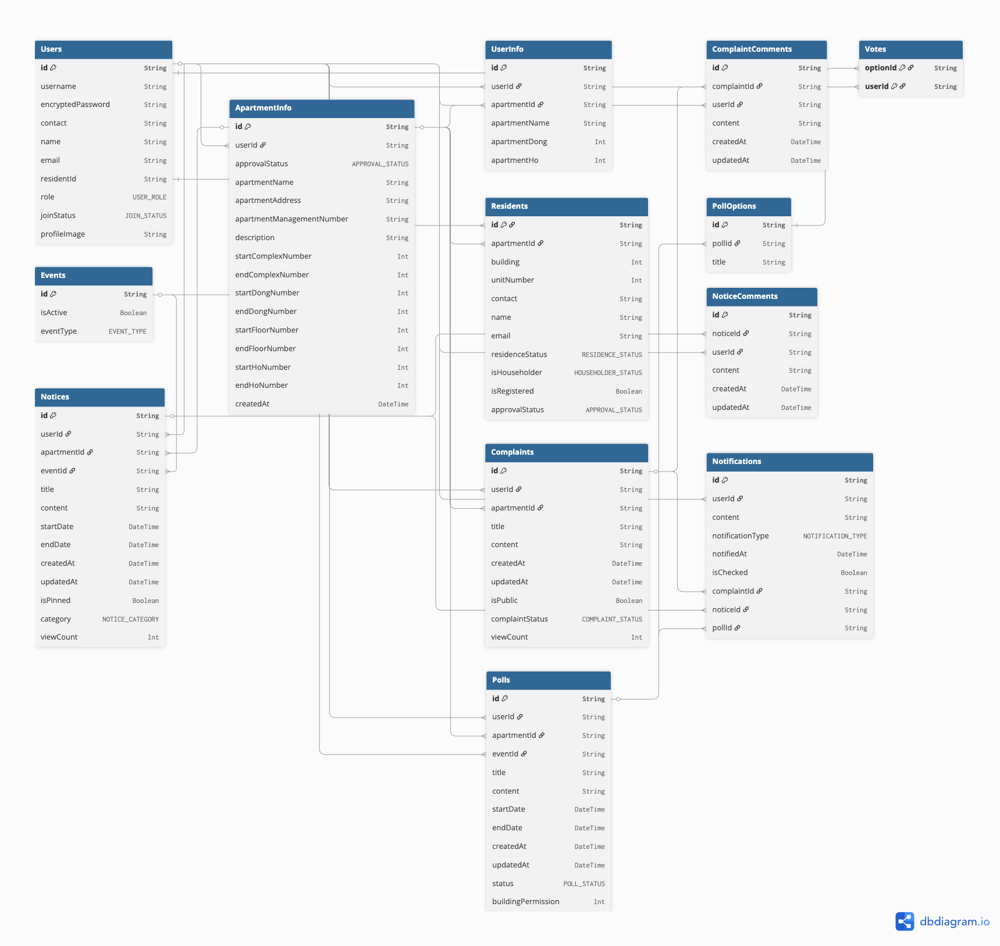

# 🌟 2팀

### https://www.notion.so/2-2140d83eacf98069966cc1a790232cf6?source=copy_link

## 팀원 구성

#### 염찬영(팀장) (개인 Github 링크)

#### 노제인 (개인 Github 링크)

#### 신민수 (개인 Github 링크)

#### 이민호 (개인 Github 링크)

# 🌆 프로젝트 소개

- WeLive 주민들과 아파트 관리 단체를 위한 상호관리 플랫폼
- 프로젝트 기간: 2024.6.16 ~ 2024.07.28

#### 📌 주차별 계획

- **Week 1**: 기획 및 역할 분담, 개발 시작
- **Week 2**: 백엔드 초기 개발
- **Week 3**: 개발 진행, 중간 발표
- **Week 4**: 개발 진행
- **Week 5:** 기능 통합 및 테스트
- **Week 6:** 배포 및 최종 발표

---

#### 기술 스택

- Backend: Express.js, Prisma ORM
- Database: PostgreSQL
- 협업 도구: Git & Github, Discord, Notion
- 배포 : AWS EC2, RDS, S3

#### 👥 담당 기능 정리

- **염찬영(팀장)**

  - 게시판 (투표, 공지, 민원)
  - 일정 관리

- **노제인**

  - 게시판 (투표, 공지, 민원)
  - 실시간 알림

- **신민수**

  - 인증 (로그인, 회원가입)
  - 유저 프로필 관리
  - 계정 관련 기능
  - S3 연동

- **이민호**
  - 입주민 관리
  - 아파트 정보
  - EC2, RDS 연동

#### 🗂️ 폴더 구조

```bash
.
📂 src
├── 📂 controllers
│   ├── userController.ts
│   └── authController.ts
├── 📂 dto
│   └── user.dto.ts
├── 📂 errors
│   └── errorHandler.ts
├── 📂 lib
│   └── prismaClient.ts
├── 📂 middlewares
│   ├── authMiddleware.ts
│   └── errorMiddleware.ts
├── 📂 repositories
│   ├── userRepository.ts
│   └── groupRepository.ts
├── 📂 request
│   └── userRequest.ts
├── 📂 routes
│   ├── userRoute.ts
│   └── groupRoute.ts
├── 📂 services
│   ├── userService.ts
│   └── authService.ts
├── 📂 sockets
│   └── socketHandler.ts
├── 📂 structs
│   └── commonStruct.ts
├── 📂 types
│   └── index.d.ts
├── 📂 utils
│   └── jwt.ts
└── main.ts
```

### 🚀 배포 AWS EC2

http://ec2-13-125-152-161.ap-northeast-2.compute.amazonaws.com/swagger/

### 📊 ERD



#### 프로젝트 회고록

[발표자료 링크 or 첨부파일]
