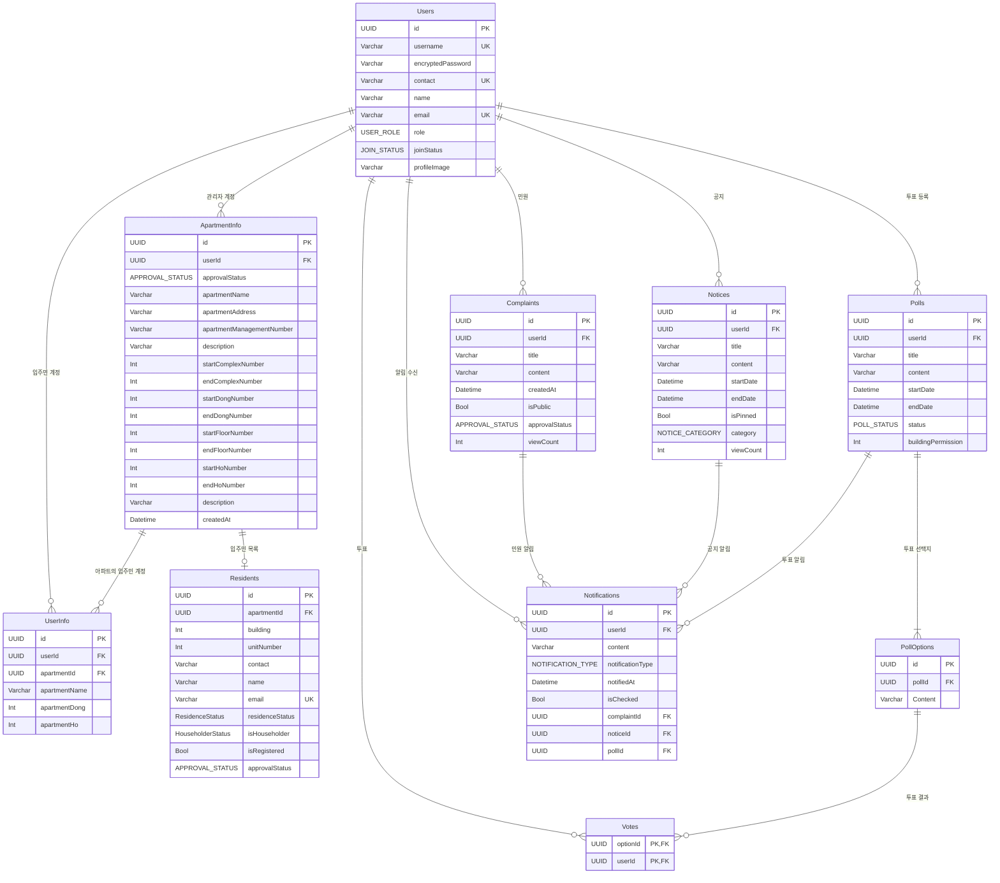

```mermaid
erDiagram
Users {
  UUID id PK
  Varchar username UK
  Varchar encryptedPassword
  Varchar contact UK
  Varchar name
  Varchar email UK
  USER_ROLE role
  JOIN_STATUS joinStatus
  Varchar profileImage
}
%% USER_ROLE : SUPER_ADMIN, ADMIN, USER
%% JOIN_STATUS : APPROVED, REJECTED, PENDING
%% nullable : profileImage

ApartmentInfo {
  UUID id PK
  UUID userId FK
  APPROVAL_STATUS approvalStatus
  Varchar apartmentName
  Varchar apartmentAddress
  Varchar apartmentManagementNumber
  Varchar description
  Int startComplexNumber
  Int endComplexNumber
  Int startDongNumber
  Int endDongNumber
  Int startFloorNumber
  Int endFloorNumber
  Int startHoNumber
  Int endHoNumber
  Varchar description
  Datetime createdAt
}
%% APPROVAL_STATUS : UNRECEIVED, PENDING, APPROVED
%% nullable : startComplexNumber, endComplexNumber

UserInfo {
  UUID id PK
  UUID userId FK
  UUID apartmentId FK
  Varchar apartmentName
  Int apartmentDong
  Int apartmentHo
}

Residents {
  UUID id PK
  UUID apartmentId FK
  Int building
  Int unitNumber
  Varchar contact
  Varchar name
  Varchar email UK
  ResidenceStatus residenceStatus
  HouseholderStatus isHouseholder
  Bool  isRegistered
  APPROVAL_STATUS approvalStatus
}
%% ResidenceStatus : RESIDENCE, NO_RESIDENCE
%% HouseholderStatus : HOUSEHOLDER, MEMBER

Complaints {
  UUID id PK
  UUID userId FK
  Varchar title
  Varchar content
  Datetime createdAt
  Bool isPublic
  APPROVAL_STATUS approvalStatus
  Int viewCount
}
%% viewCount @default(0)

Polls {
  UUID id PK
  UUID userId FK
  Varchar title
  Varchar content
  Datetime startDate
  Datetime endDate
  POLL_STATUS status
  Int buildingPermission
}
%% POLL_STATUS : PENDING, IN_PROGRESS, CLOSED
%% buildingPermission 0이면 전체, 그 이외에는 특정 '동' 하나 선택

PollOptions {
  UUID id PK
  UUID pollId FK
  Varchar Content
}

Votes {
  UUID optionId PK, FK
  UUID userId PK, FK
}

Notices {
  UUID id PK
  UUID userId FK
  Varchar title
  Varchar content
  Datetime startDate
  Datetime endDate
  Bool isPinned
  NOTICE_CATEGORY category
  Int viewCount
}
%% NOTICE_CATEGORY : MAINTENANCE, EMERGENCY, COMMUNITY, RESIDENT_VOTE, ETC
%% viewCount @default(0)

Notifications {
  UUID id PK
  UUID userId FK
  Varchar content
  NOTIFICATION_TYPE notificationType
  Datetime notifiedAt
  Bool isChecked
  UUID complaintId FK
  UUID noticeId FK
  UUID pollId FK
}
%% NOTIFICATION_TYPE : COMPLAINT_RESOLVED, 민원 등록, 공지 등록, 회원가입신청
%% isChecked @default(false)
%% notifiedAt @default(now())
%% nullable : complaintId, noticeId, pollId

Users ||--o{ ApartmentInfo : "관리자 계정"
Users ||--o{ UserInfo : "입주민 계정"
ApartmentInfo ||--o{ UserInfo : "아파트의 입주민 계정"
ApartmentInfo ||--o| Residents : "입주민 목록"
Users ||--o{ Complaints : "민원"
Users ||--o{ Polls : "투표 등록"
Polls ||--|{ PollOptions : "투표 선택지"
Users ||--o{ Votes : "투표"
PollOptions ||--o{ Votes : "투표 결과"
Users ||--o{ Notices : "공지"
Users ||--o{ Notifications : "알림 수신"
Complaints ||--o{ Notifications : "민원 알림"
Notices ||--o{ Notifications : "공지 알림"
Polls ||--o{ Notifications : "투표 알림"
```
